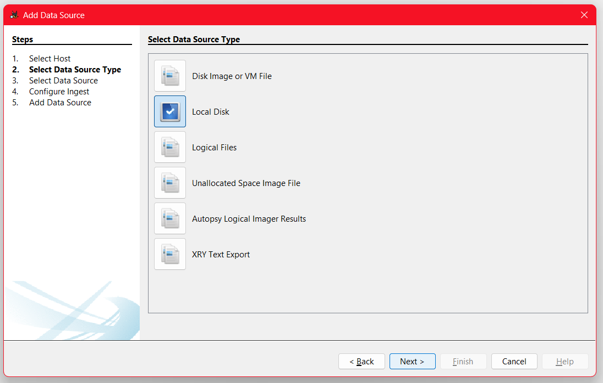
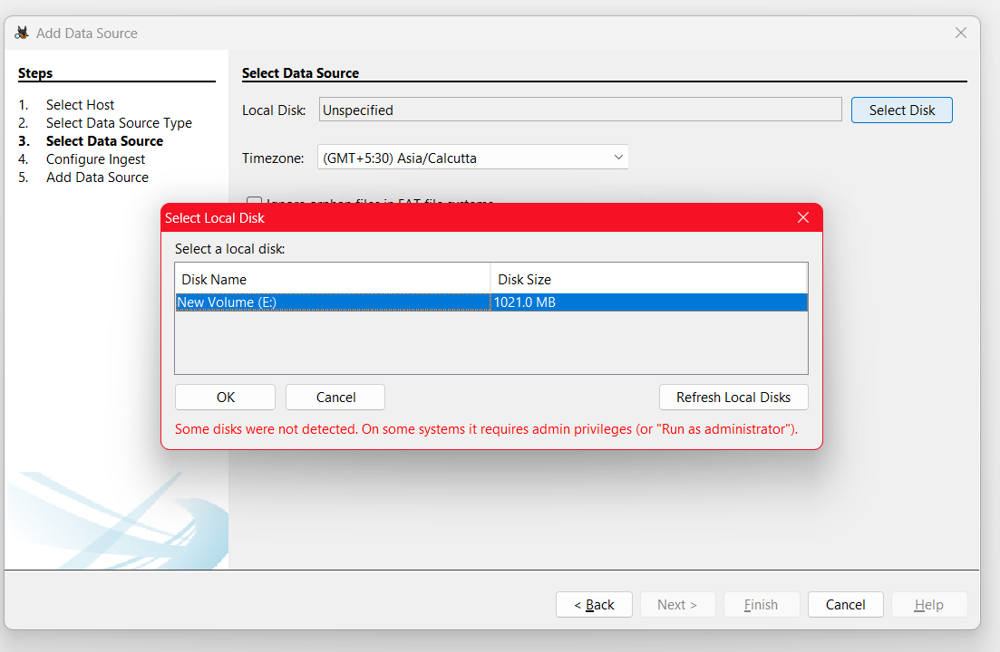

# EXP 4: Using-the-Autopsy-retrieve-the-deleted-files

## AIM:
To install Autopsy software on windows operating system and analyse the file and folder configuration.

## EQUIPMENT REQUIRED:
● Hardware: Personal Computer (PC)
```
Register Number:212223100035
Name: Muhammad Afshan A
```
## DESIGN STEPS:

### **1. Copy Files to the Virtual Disk**  
- Open **File Explorer** → Go to the new drive (`E:`), where the folder created in the New Virtual Disk
- Create a new folder or use the entire disk and then copy **images or files** into it.  

### **2. Delete the Files**  
- Select any one or two images → Press **Delete**.  
- Empty the **Recycle Bin** to permanently delete them.  

### **3. Recover Deleted Files Using Autopsy**  
### **Open Autopsy & Create a New Case** 

- Launch **Autopsy** and **Run as a administrator**  
- Click **Create New Case**.  


- Enter a **Case Name** (e.g., `Autopsy-1`).  
- Choose a **Case Folder** location.  
- Click **Next** → Click **Finish**.  


### **Add the Virtual Disk as an Evidence Source**  
- Click **Add Data Source**  → **Select Host**


- Select **Local Disk** → **next** 



- Select Disk → **Choose the VHD drive (`New Volume(E:)`)**



- Click **Next** → Keep default settings → Click **Finish**.  
- Wait for Autopsy to process the disk.  

### **Recover Deleted Files**  
- Go to **File Views** (left panel).  


- Click **Deleted Files** → Find your deleted images.  
- Right-click an image → Click **Extract File**.  


- Select a folder to see the recovered files (e.g., `K:\DFDI-Extracted`).  
- Image is recovered successfully.


## Output :
### Folder before deleting the files


### Folder after deleting the files


### Folder after extracting the deleted images using autopsy


## Result:
Successfully extracted the deleted files from unallocated space using the Autospy tool.
